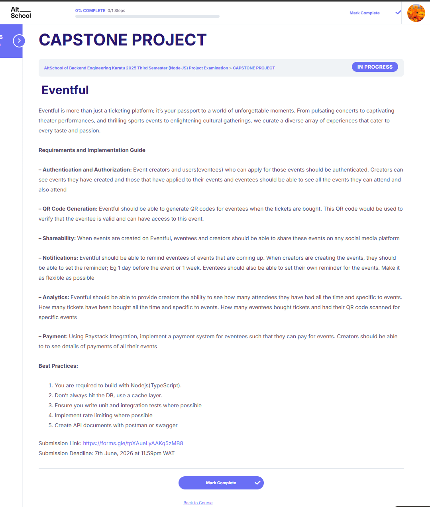

# altschool-s03-e01 - Eventful
AltSchool Backend Engineering Third Semester Exam (Capstone Project)

Eventful is a ticketing platform API. Event creators publish events, set reminders, and track analytics. Eventees browse events, register, pay for tickets, and receive a QR code by email for venue entry. Built with NestJS and TypeScript.



## Features

- JWT authentication with two roles: `creator` and `eventee`
- Creators can create, update, and delete events with configurable capacity and ticket price
- Shareable event links via a unique token (no login required to view)
- Eventees register for events and pay via Paystack; ticket status updates automatically via webhook
- QR code generated after payment and emailed to the eventee
- Creators scan QR codes at the door to verify attendance
- Scheduled reminder emails; creators set a default window (e.g. 24h before), eventees can override per ticket
- Reminder idempotency: each ticket gets exactly one reminder email
- Analytics for creators: total tickets sold, total revenue, QR scan counts per event
- In-memory response cache (60s) on the public events list
- Rate limiting: 60 requests per minute globally

## Prerequisites

Before running this project, make sure you have the following:

- [Node.js](https://nodejs.org/) (v18 or higher)
- [npm](https://www.npmjs.com/) (comes with Node.js)
- [Git](https://git-scm.com/)
- A [Supabase](https://supabase.com) project (free tier works)
- A [Paystack](https://paystack.com) account (test keys work)
- A Gmail account with an [App Password](https://myaccount.google.com/apppasswords) (for sending emails)

## Getting Started

### 1. Clone the Repository

```bash
git clone https://github.com/akcumeh/altschool-s03-e01.git
cd altschool-s03-e01
```

### 2. Install Dependencies

```bash
cd backend && npm install
```

### 3. Set Up Environment Variables

Copy `.env.example` to `.env` and fill in the values:

```bash
cp .env.example .env
```

Your `.env` should contain:
- `SUPABASE_URL`: Your Supabase project URL
- `SUPABASE_SERVICE_ROLE_KEY`: Your Supabase service-role key (not the anon key)
- `JWT_SECRET`: Any long random string
- `JWT_EXPIRES_IN`: Token expiry (default: `7d`)
- `MAIL_HOST` / `MAIL_PORT` / `MAIL_USER` / `MAIL_PASS`: Gmail SMTP settings (get your App Password)
- `MAIL_FROM`: Display name + address, e.g. `"Eventful <you@gmail.com>"`
- `PAYSTACK_SECRET_KEY`: Your Paystack secret key (also used to verify incoming webhooks)
- `PORT`: Port to run on (default: `3000`)

### 4. Set Up the Database

Open your Supabase dashboard, go to **SQL Editor**, and run these two files in order:

1. `backend/supabase/schema.sql` - creates all tables (users, events, tickets, reminder_logs)
2. `backend/supabase/get_due_reminders.sql` - creates the custom SQL function used by the reminder scheduler

### 5. Start the Application

```bash
# development (watch mode)
npm run start:dev

# production
npm run start:prod
```

The server will start on `http://localhost:3000`.

## API Reference

Full Postman documentation: **[View on Postman](https://documenter.getpostman.com/view/38823654/2sBXwsMVu2)**.

Base URL (local): `http://localhost:3000`

### Auth
| Method | Endpoint | Auth | Description |
|--------|----------|------|-------------|
| POST | `/auth/register` | - | Register as `creator` or `eventee` |
| POST | `/auth/login` | - | Login, returns `access_token` |

### Events
| Method | Endpoint | Auth | Description |
|--------|----------|------|-------------|
| POST | `/events` | Creator | Create a new event |
| GET | `/events` | - | List all published events (cached 60s) |
| GET | `/events/mine` | Creator | Creator's own events |
| GET | `/events/:id` | - | Get a single event |
| GET | `/events/share/:token` | - | Get event by shareable token |
| PATCH | `/events/:id` | Creator (owner) | Update event |
| DELETE | `/events/:id` | Creator (owner) | Delete event |

### Tickets
| Method | Endpoint | Auth | Description |
|--------|----------|------|-------------|
| POST | `/tickets/:eventId` | Eventee | Register for an event (creates pending ticket) |
| GET | `/tickets/mine` | Eventee | View own tickets |
| POST | `/tickets/:eventId/pay` | Eventee | Initialize Paystack payment |
| POST | `/tickets/:eventId/verify` | Eventee | Verify payment after Paystack redirect (no webhook URL needed) |
| PATCH | `/tickets/:ticketId/reminder` | Eventee | Set personal reminder window |
| POST | `/tickets/:ticketId/scan` | Creator | Scan QR at venue, marks attendance |

### Payment
| Method | Endpoint | Auth | Description |
|--------|----------|------|-------------|
| POST | `/payment/webhook` | - (Paystack only) | Paystack webhook - marks ticket paid, sends QR email |

### Analytics
| Method | Endpoint | Auth | Description |
|--------|----------|------|-------------|
| GET | `/analytics/overview` | Creator | Total tickets sold, revenue, attendees |
| GET | `/analytics/events/:eventId` | Creator | Per-event: tickets, revenue, QR scans |

## Project Structure

```
altschool-s03-e01/
├── backend/
│   ├── src/
│   │   ├── analytics/            # Creator stats endpoints
│   │   ├── auth/                 # Register, login, JWT strategy
│   │   │   └── dto/
│   │   ├── common/
│   │   │   ├── decorators/       # @CurrentUser, @Roles
│   │   │   └── guards/           # JwtAuthGuard, RolesGuard
│   │   ├── events/               # Event CRUD + cache layer
│   │   │   └── dto/
│   │   ├── notifications/        # Email sending + hourly reminder cron
│   │   ├── payment/              # Paystack init + webhook handler
│   │   ├── qr/                   # QR code generation
│   │   ├── supabase/             # Supabase client (global singleton)
│   │   ├── tickets/              # Ticket registration, reminder, QR scan
│   │   │   └── dto/
│   │   ├── users/                # User queries (no controller)
│   │   ├── app.module.ts
│   │   └── main.ts
│   ├── supabase/
│   │   └── get_due_reminders.sql # custom SQL function for the reminder scheduler
│   ├── test/                     # e2e test stubs
│   ├── .env.example
│   ├── Eventful.postman_collection.json
│   └── Eventful.postman_environment.json
├── s03-e01.png
└── README.md
```

## Stack Used

- **Node.js** (**NestJS**) - Backend framework
- **TypeScript** - Type safety
- **Supabase** (PostgreSQL) - Database
- **Paystack** - Payment processing
- **Nodemailer** + Gmail SMTP - Transactional email
- **qrcode** - QR code generation
- **@nestjs/schedule** - Cron-based reminder scheduler
- **@nestjs/cache-manager** - In-memory response caching
- **@nestjs/throttler** - Rate limiting
- **class-validator** / **class-transformer** - Request validation
- **bcrypt** - Password hashing
- **Jest** - Unit and e2e testing

## Author

Thank you for reading this far! Connect with me on:

- Website - [Angel Umeh | Software Engineer](https://angelumeh.dev)
- GitHub - [Angel Umeh](https://github.com/akcumeh)
- Twitter - [@akcumeh](https://x.com/akcumeh)
